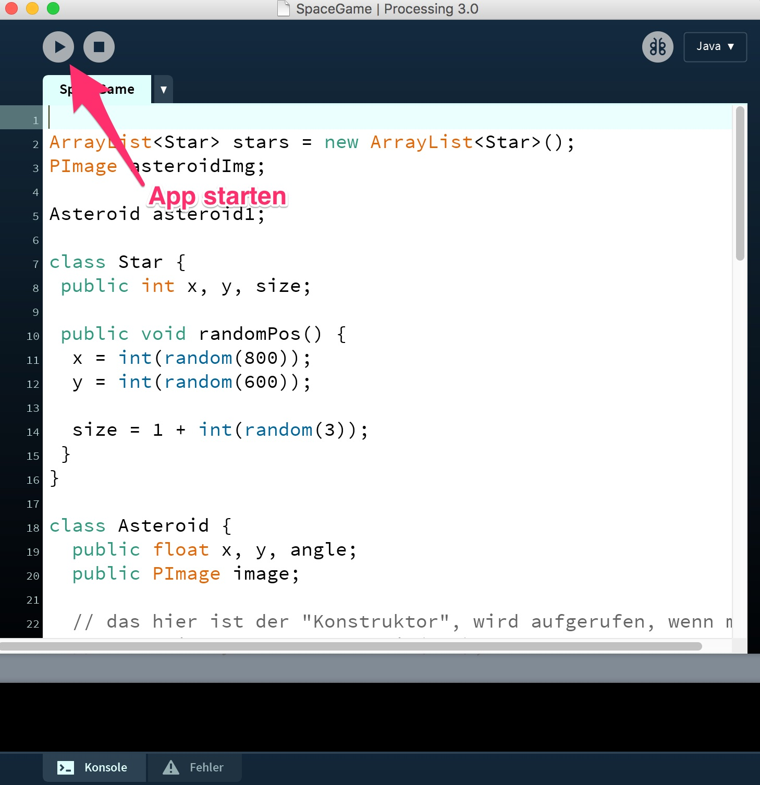

# Processing Tutorial

Eine kleine Einführung in Processing. Kann direkt mit den CoderDojo-Kids durchgearbeitet werden.

# Processing herunterladen

Processing findet ihr auf https://processing.org/download/ - eine Spende ist optional möglich. Einfach herunterladen und den Ordner irgendwo hinlegen. Eine Installation ist nicht erforderlich.

# Was ist Processing?

Diese Erklärung ist vermutlich nicht akkurat... sollte aber für unsere Zwecke reichen: Processing ist eine IDE und ein Wrapper um Java/OpenGL. Man schreibt echten Java-Code, unterliegt aber weniger Einschränkungen:

* man braucht keine Klasse um alles herum, sondern kann C-style Code schreiben (imperativ).
* kein public static void main
* vorgefertige grafische Funktionen
* auf Wunsch kann man alle Java-std-Klassen nutzen (ArrayList, usw.)
* eigene Klassen können auch definiert werden

# Processing öffnen

Wenn man die Binary ausführt, sieht man einen Editor. Per PLAY-button (oder ^R, bzw. R) kann ein Programm gestartet werden, nachdem es eingetippt wurde. Mit Datei > Exportieren... kann eine Binary gespeichert werden, auf Wunsch kann sogar Java mit in die Binary gebundelt werden. So kann man ein Projekt einfach Freunden zur Verfügung stellen - sie müssen dann noch nichtmal Java installieren.

# Beispielprogramme

Ich fange gerne mit diesen Icebreakern an:

[Linie, die sich bewegt](linie_in_bewegung.md)
[Einfaches Malprogramm](malen.md)
