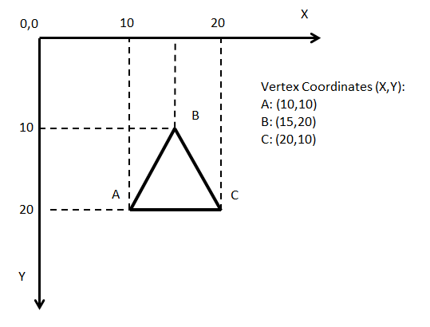

# Linie in Bewegung

Hier malen wir ein Fenster, in dem sich eine Linie hin- und herbewegt.

## Fenster mit Linie

Am besten direkt Copy und Pasten! Direkt das Ergebnis zeigen und danach den Code erklären.

```java
// wird einmal beim Programmstart aufgerufen
void setup() {
  size(800, 600); // Fenster in der Auflösung 800x600 zeichnen
}

// wird einmal pro Frame aufgerufen, also etwa 60 mal pro Sekunde
void draw() {
  background(0, 0, 0); // schwarzen Hintergrund malen
  
  // Strichfarbe setzen, gilt für alles, was ab jetzt gemalt wird:
  stroke(255, 255, 255);
  
  // Linie malen. Die Argumente sind: startX, startY, endX, endY
  line(0, 300, 800, 300);
}
```

Um zu verstehen, wie man Punkte im Fenster angibt (X- und Y-Position), muss man ein Koordinatensystem verstehen. Das funktioniert im Computer aber etwas anders als in der Mathematik. Der Nullpunkt ist nicht unten links,
sondern _oben_ links. Siehe dazu auch diese Zeichnung:



Die Farben, die bei `stroke` und `background` verwendet werden, sind im RGB-Format. RGB erklären :) Ich verwende dafür immer Wasserfarben, da kann man die Farben ja auch mischen.

## Die Linie bewegt sich

Da `draw()` immer wieder aufgerufen wird, können wir einfach Bewegungen erzeugen. So lassen wir die Linie wandern:

```java
float lineY;
float lineSpeed = 3.0;

void setup() {
  size(800, 600);
  
  /*
   * Zum Start mittig auf die Y-Achse platzieren.
   * `height` ist die Fenstergröße. Erst nach Aufruf von `size` verfügbar.
   */
  lineY = height / 2;
}

void draw() {
  background(0, 0, 0);

  stroke(255, 255, 255);
  line(0, lineY, 800, lineY);
  
  // Wichtig: hier wird die Bewegung umgesetzt!
  lineY = lineY + lineSpeed;
  
  // Wir wollen nicht, dass die Linie das Fenster verlässt:
  if (lineY >= height) { // Bildschirm unten verlassen?
    lineSpeed = -lineSpeed;  // Beschleunigung umkehren
  }
  
  if (lineY <= 0) { // Bildschirm oben verlassen?
    lineSpeed = -lineSpeed; // Beschleunigung umkehren
  }
}
```

## Ein Rechteck dazumalen

Jetzt malen wir noch ein Rechteck dazu, das sich zusammen mit der Linie bewegt.

```java
void draw() {
  background(0, 0, 0);
  
  fill(200, 0, 200);
  // Rechteck malen
  rect(width / 2 - 50, // X
       lineY - 20,     // Y
       100,            // Breite
       40);            // Höhe

  // ...
}
```

`fill` setzt die Füllfarbe. Alle Formen, die komplexer als eine Linie sind, haben eine Randfarbe und eine Füllfarbe. Die Randfarbe wird mit `stroke` gesetzt, die Füllfarbe mit `fill`.

Achtung, die Reihenfolge der Zeichenbefehle ist wichtig! Wenn man zuerst `rect` und dann `line` aufruft, wird zuerst das Rechteck gemalt, und die Linie oberhalb davon. Wie bei einer Leinwand. Was man zuerst malt, wird von nachfolgenden Pinselstrichen übermalt.

## Aufgaben

An dieser Stelle sollten die Kinder experimentieren. Folgende Möglichkeiten gibt es zum Beispiel:

* mit `strokeWeight(widthInPixels)` kann die Strichdicke beeinflusst werden. Damit kann man einen coolen Comicstyle kreieren. Einfach mal `strokeWeight(10)` setzen und schauen, was passiert.
* wie kann man per `rect` ein Quadrat malen? Ein Quadrat ist ja auch ein Rechteck, oder?
* mit `ellipse` kann man eine Ellipse - oder eben einen Kreis malen. Die Funktion akzeptiert die gleichen Parameter, wie `rect`.


