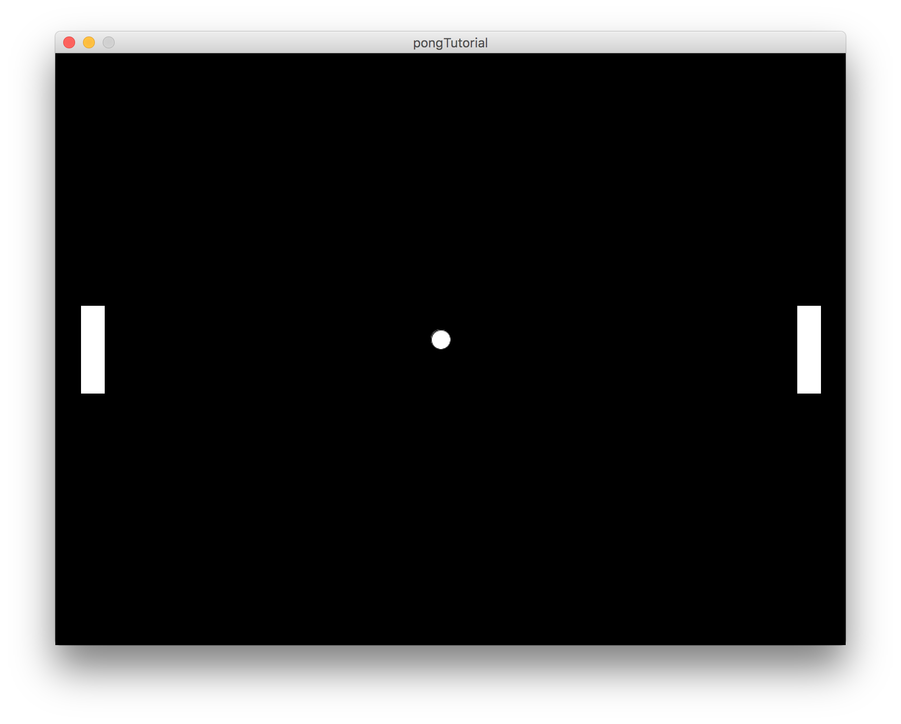

# Pong

Pong ist wohl der Spieleklassiker schlechthin. Die erste Version erschien 1972 von Atari und war in Spielhallen sehr
beliebt.

# Spielregeln

> Das Spielprinzip von Pong ist simpel und ähnelt dem des Tischtennis: Ein Punkt ("Ball") bewegt sich auf dem Bildschirm hin und her. Jeder der beiden Spieler steuert einen senkrechten Strich ("Schläger"), den er mit Tasten (hoch/runter) nach oben und unten verschieben kann. Lässt man den "Ball" am "Schläger" vorbei, erhält der Gegner einen Punkt.

Auszug aus [Wikipedia](https://de.wikipedia.org/wiki/Pong)

Zum Start kann man Pong einfach implementieren: zwei Spieler spielen an einem Rechner gegeneinander. Oder man spielt selber beide Schläger.
Später können wir das Spiel so erweitern, dass man gegen einen Computergegner (Bot, KI) spielen kann.

# Der Grundaufbau

Zuerst brauchen wir wie immer ein Fenster. Außerdem platzieren wir die Spieler auf dem Spielfeld

```java
/* Positionen der Schläger. Da die Spieler sie nur nach oben
 * und unten bewegen können, ist nur die Y-Koordinate variabel.
 * Auf der X-Achse bleiben die Schläger immer, wo sie sind. */
float player1y, player2y;

/* Beim Ball sieht es anders aus. Dieser bewegt sich frei im Raum.
 * Daher brauchen wir hier X- und Y-Koordinate. */
float ballx, bally;

void setup() {
  size(800, 600);
  
  // Spielerpositionen: zum Start mittig
  player1y = height / 2 - 45;
  player2y = height / 2 - 45;
  
  // Ball mittig positionieren
  ballx = width / 2 - 10;
  bally = height / 2 - 10;
}

void draw() {
  background(0, 0, 0);
  fill(255, 255, 255);
  
  // Spieler 1
  rect(25, player1y, 25, 90);
  
  // Spieler 2
  rect(width - 50, player2y, 25, 90);
  
  // Ball
  ellipse(ballx, bally, 20, 20);
}
```
Danach haben wir dieses Ergebnis:



